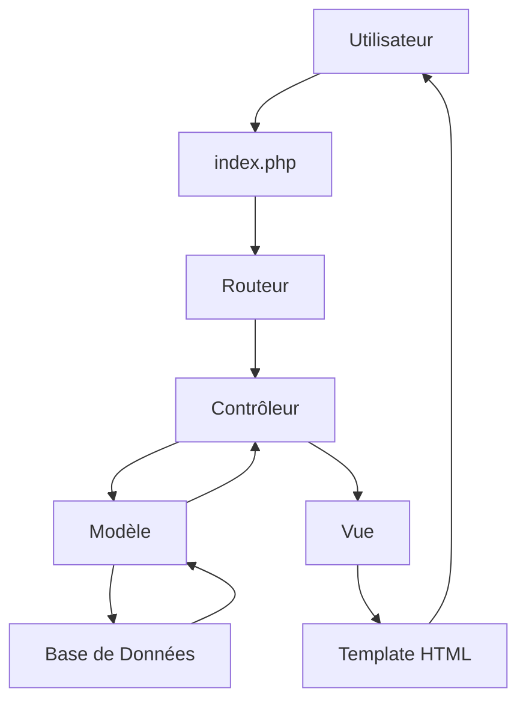

# 🚀 ASBL-ONG-MANAGER - Système de Gestion

[](https://php.net)
[](https://mysql.com)
[](LICENSE)
[](https://github.com/dontka/crud-asbl-ong)

> **Plateforme de gestion d’organisation tout-en-un, modulaire, intelligente, collaborative et conforme, couvrant tous les besoins métiers d’une ONG, association ou entreprise moderne. (ONG)**

---

## 📋 Table des Matières

- [✨ Vue d'ensemble](#-vue-densemble)
- [🎯 Fonctionnalités](#-fonctionnalités)
- [🛠️ Technologies](#️-technologies)
- [📦 Installation](#-installation)
- [⚙️ Configuration](#️-configuration)
- [🚀 Utilisation](#-utilisation)
- [🏗️ Architecture](#️-architecture)
- [📊 Scripts et Outils](#-scripts-et-outils)
- [🔧 Développement](#-développement)
- [🌐 Déploiement](#-déploiement)
- [🤝 Contribution](#-contribution)
- [📞 Support](#-support)
- [📄 Licence](#-licence)

---

## ✨ Vue d'ensemble

CRUD ASBL-ONG est une plateforme web complète développée en **PHP pur** (sans framework) pour la gestion efficace des organisations à but non lucratif. Le système offre une interface intuitive pour gérer les membres, événements, projets et dons avec un focus sur la sécurité, la performance et l'évolutivité.

### 🎯 Cas d'usage
- **Associations caritatives** : Gestion des bénévoles et dons
- **Clubs sportifs** : Organisation d'événements et suivi des membres
- **Organisations environnementales** : Gestion de projets et campagnes
- **Groupes communautaires** : Coordination d'activités et communication

---

## 🎯 Fonctionnalités

### 👥 Gestion des Membres
- ✅ Inscription et gestion des profils
- ✅ Suivi des adhésions et statuts
- ✅ Historique des participations
- ✅ Export des données membres

### 📅 Gestion des Événements
- ✅ Création et organisation d'événements
- ✅ Gestion des inscriptions et présences
- ✅ Notifications automatiques
- ✅ Calendrier intégré

### 🎯 Gestion des Projets
- ✅ Planification et suivi d'avancement
- ✅ Gestion budgétaire
- ✅ Assignation des responsables
- ✅ Rapports de progression

### 💰 Gestion des Dons
- ✅ Suivi des contributions financières
- ✅ Génération de reçus fiscaux
- ✅ Rapports financiers
- ✅ Intégration paiements multiples

### 🔐 Sécurité et Authentification
- ✅ Système de rôles (Admin, Modérateur, Membre)
- ✅ Authentification sécurisée (bcrypt)
- ✅ Protection CSRF et XSS
- ✅ Logs d'audit complets

### 📊 Rapports et Analytics
- ✅ Tableaux de bord personnalisés
- ✅ Exports CSV/PDF/Excel
- ✅ Statistiques en temps réel
- ✅ Rapports automatisés

---

## 🛠️ Technologies

### Backend
```php
🐘 PHP 8.3+          # Langage principal
🗄️  MySQL 8.0+       # Base de données
🔒 PDO               # Accès sécurisé DB
🛡️  OpenSSL          # Chiffrement
```

### Frontend
```html
🌐 HTML5             # Structure
🎨 CSS3              # Styles
⚡ JavaScript ES6+   # Interactivité
🎯 Font Awesome      # Icônes
```

### Outils et Sécurité
```bash
🔧 Composer          # Gestion dépendances
🐙 Git              # Contrôle version
🛡️  CSRF Protection # Sécurité formulaires
🔐 bcrypt           # Hashage mots de passe
📊 phpMyAdmin       # Gestion DB
```

### Environnements Supportés
- ✅ **Développement** : XAMPP, Laragon, WAMP
- ✅ **Production** : Apache/Nginx + MySQL
- ✅ **Cloud** : Compatible AWS, DigitalOcean, etc.

---

## 📦 Installation

### Prérequis Système
- **PHP** : 8.3 ou supérieur
- **MySQL** : 8.0 ou supérieur
- **Serveur Web** : Apache/Nginx
- **Extensions PHP** : `pdo`, `pdo_mysql`, `mbstring`, `session`, `json`, `openssl`

### Installation Automatisée (Recommandée)

```bash
# 1. Cloner le repository
git clone https://github.com/dontka/crud-asbl-ong.git
cd crud-asbl-ong

# 2. Installer les dépendances (si applicable)
composer install
# 3. Accéder au système
# http://localhost/crud-asbl-ong/
```

### Installation Manuelle

```bash
# Télécharger et extraire l'archive
wget https://github.com/dontka/crud-asbl-ong/archive/main.zip
unzip main.zip
cd crud-asbl-ong-main

# Configuration manuelle...
```
### Variables d'Environnement (`.env`)

```bash
# Base de données
DB_HOST=localhost
DB_NAME=crud_asbl_ong
DB_USER=db_user
DB_PASS=secure_password

# Application
APP_ENV=production
DEBUG_MODE=false
LOG_LEVEL=warning

# Sécurité
SECRET_KEY=your-super-secret-key
CSRF_TOKEN_LIFETIME=3600

# Email (optionnel)
SMTP_HOST=smtp.gmail.com
SMTP_USER=your-email@gmail.com
SMTP_PASS=your-app-password
```

### Permissions Fichiers

```bash
# Permissions sécurisées
chmod 755 .htaccess
chmod 644 *.php
chmod 644 assets/css/*.css
chmod 644 assets/js/*.js
chmod 755 uploads/
chmod 755 logs/
```

---

## 🚀 Utilisation

### Premiers Pas

1. **Accès initial** : `http://localhost/crud-asbl-ong/`
2. **Connexion admin** : `admin` / `admin123`
3. **Documentation** : `/documentation`

### Interface Utilisateur

#### Tableau de Bord
- 📊 Vue d'ensemble des activités
- 👥 Statistiques des membres
- 📅 Événements à venir
- 💰 État des dons

#### Navigation
- **Membres** : Gestion complète des adhérents
- **Événements** : Organisation et suivi
- **Projets** : Planification et monitoring
- **Dons** : Suivi financier
- **Utilisateurs** : Administration (admin uniquement)

### Raccourcis Clavier
- `Ctrl + S` : Sauvegarder (formulaires)
- `Ctrl + F` : Recherche
- `Échap` : Annuler/Fermer
- `F5` : Actualiser

### API REST (Optionnel)

```bash
# Exemples d'endpoints
GET  /api/members     # Liste membres
POST /api/members     # Créer membre
GET  /api/events      # Liste événements
POST /api/donations   # Enregistrer don
```

---

## 🏗️ Architecture

### Pattern MVC (Modèle-Vue-Contrôleur)

### Structure Complète

Voir le fichier STRUCTURE_AVANCEE.md
### Flux de Données



---

## 📊 Scripts et Outils


## 🔧 Développement


#### 5. Ajouter les Routes

core/Route.php

---

## 🌐 Déploiement

### Environnements

#### Développement
```bash
# Configuration locale
APP_ENV=development
DEBUG_MODE=true
LOG_LEVEL=debug
```

#### Production
```bash
# Configuration production
APP_ENV=production
DEBUG_MODE=false
LOG_LEVEL=warning
```

### Serveur Web - Apache

```apache
# .htaccess
RewriteEngine On
RewriteCond %{REQUEST_FILENAME} !-f
RewriteCond %{REQUEST_FILENAME} !-d
RewriteRule ^(.*)$ index.php [QSA,L]

# Sécurité
<Files "config.php">
    Order Allow,Deny
    Deny from all
</Files>
```

### Serveur Web - Nginx

```nginx
server {
    listen 80;
    server_name your-domain.com;
    root /var/www/crud-asbl-ong;
    index index.php;

    location / {
        try_files $uri $uri/ /index.php?$query_string;
    }

    location ~ \.php$ {
        include fastcgi_params;
        fastcgi_pass unix:/var/run/php/php8.3-fpm.sock;
        fastcgi_param SCRIPT_FILENAME $document_root$fastcgi_script_name;
    }

    # Sécurité - Bloquer l'accès aux fichiers sensibles
    location ~ /(config|logs|tests)/ {
        deny all;
        return 404;
    }
}
```

### SSL/TLS (Recommandé)

```bash
# Let's Encrypt (gratuit)
certbot --nginx -d your-domain.com

# Ou certificat payant
# Configuration manuelle dans nginx/apache
```

### Optimisation Performance

```bash
# Cache opcode PHP
php -r "echo 'OPcache enabled: ' . (extension_loaded('opcache') ? 'Yes' : 'No') . PHP_EOL;"

# Compression GZIP
# Configuration dans nginx/apache

# CDN pour les assets statiques
# Cloudflare, AWS CloudFront, etc.
```

### Monitoring Production

```bash
# Logs à surveiller
tail -f logs/error.log
tail -f logs/access.log

# Métriques système
htop
df -h
free -h

# Monitoring applicatif
php monitor.php check
```

---

## 🤝 Contribution

### Processus de Contribution

1. **Fork** le projet
2. **Clone** votre fork : `git clone https://github.com/your-username/crud-asbl-ong.git`
3. **Créez** une branche : `git checkout -b feature/nouvelle-fonctionnalite`
4. **Commitez** vos changements : `git commit -m "Ajout: Nouvelle fonctionnalité"`
5. **Poussez** : `git push origin feature/nouvelle-fonctionnalite`
6. **Créez** une Pull Request

### Standards de Code

#### PHP
```php
<?php
// Utiliser des namespaces
namespace App\Controllers;

// Nommage des classes (PascalCase)
class UserController extends Controller
{
    // Nommage des méthodes (camelCase)
    public function getUserById($id)
    {
        // Utiliser des types de retour
        return $this->model->find($id);
    }
}
```

#### JavaScript
```javascript
// Utiliser ES6+
const userController = {
    // Fonctions fléchées
    getUsers: async () => {
        try {
            const response = await fetch('/api/users');
            return await response.json();
        } catch (error) {
            console.error('Erreur:', error);
        }
    }
};
```

#### CSS
```css
/* BEM Methodology */
.user-card {
    border: 1px solid #ddd;
}

.user-card__title {
    font-size: 1.2rem;
    font-weight: bold;
}

.user-card--featured {
    border-color: #007bff;
}

## 📞 Support

### 📚 Documentation

- **[Guide Utilisateur](USER_GUIDE.md)** - Utilisation quotidienne
- **[Documentation Technique](STRUCTURE_AVANCEE.md.md)** - Architecture et développement
- **[Plan de Maintenance](PLAN_FONCTIONNALITES_AVANCEES.md)** - Administration système
- **[Guide de Connexion](LOGIN_GUIDE.md)** - Identifiants et accès

### 🐛 Signaler un Bug

1. **Vérifiez** la documentation
2. **Recherchez** dans les issues existantes
3. **Créez** une nouvelle issue avec :
   - Description détaillée
   - Étapes de reproduction
   - Environnement (PHP, MySQL, OS)
   - Logs d'erreur

### 💬 Questions

- **Forum** : [GitHub Discussions](https://github.com/dontka/crud-asbl-ong/discussions)
- **Email** : schor@alwaysdata.net
- **Chat** : Discord/Slack (lien à venir)

### 🚨 Urgences

Pour les problèmes critiques :
- **Sécurité** : schor@alwaysdata.net
- **Disponibilité** : schor@alwaysdata.net
- **Téléphone** : +243 973 768 153 (heures ouvrables)

---

## 📄 Licence

```text
MIT License

Copyright (c) 2026 CRUD ASBL-ONG Team

Permission is hereby granted, free of charge, to any person obtaining a copy
of this software and associated documentation files (the "Software"), to deal
in the Software without restriction, including without limitation the rights
to use, copy, modify, merge, publish, distribute, sublicense, and/or sell
copies of the Software, and to permit persons to whom the Software is
furnished to do so, subject to the following conditions:

The above copyright notice and this permission notice shall be included in all
copies or substantial portions of the Software.

THE SOFTWARE IS PROVIDED "AS IS", WITHOUT WARRANTY OF ANY KIND, EXPRESS OR
IMPLIED, INCLUDING BUT NOT LIMITED TO THE WARRANTIES OF MERCHANTABILITY,
FITNESS FOR A PARTICULAR PURPOSE AND NONINFRINGEMENT. IN NO EVENT SHALL THE
AUTHORS OR COPYRIGHT HOLDERS BE LIABLE FOR ANY CLAIM, DAMAGES OR OTHER
LIABILITY, WHETHER IN AN ACTION OF CONTRACT, TORT OR OTHERWISE, ARISING FROM,
OUT OF OR IN CONNECTION WITH THE SOFTWARE OR THE USE OR OTHER DEALINGS IN THE
SOFTWARE.
```

---

## 🙏 Remerciements

### Contributeurs
- **Équipe de développement** : Merci pour le code de qualité
- **Testeurs** : Pour les retours précieux
- **Communauté** : Pour le support et les suggestions

### Technologies Open Source
- **PHP** : Pour le langage robuste
- **MySQL** : Pour la base de données fiable
- **Font Awesome** : Pour les icônes élégantes
- **Composer** : Pour la gestion des dépendances

### Inspirations
- **Symfony/Laravel** : Pour les patterns MVC
- **Bootstrap** : Pour l'inspiration UI/UX
- **WordPress** : Pour la simplicité d'utilisation

---


<div align="center">

**Développé avec ❤️ pour les associations et ONG du monde entier**

---

[](https://github.com/dontka/crud-asbl-ong/stargazers)
[](https://github.com/dontka/crud-asbl-ong/network/members)
[](https://github.com/dontka/crud-asbl-ong/issues)

**⭐ Si ce projet vous aide, n'hésitez pas à lui donner une étoile !**

</div>